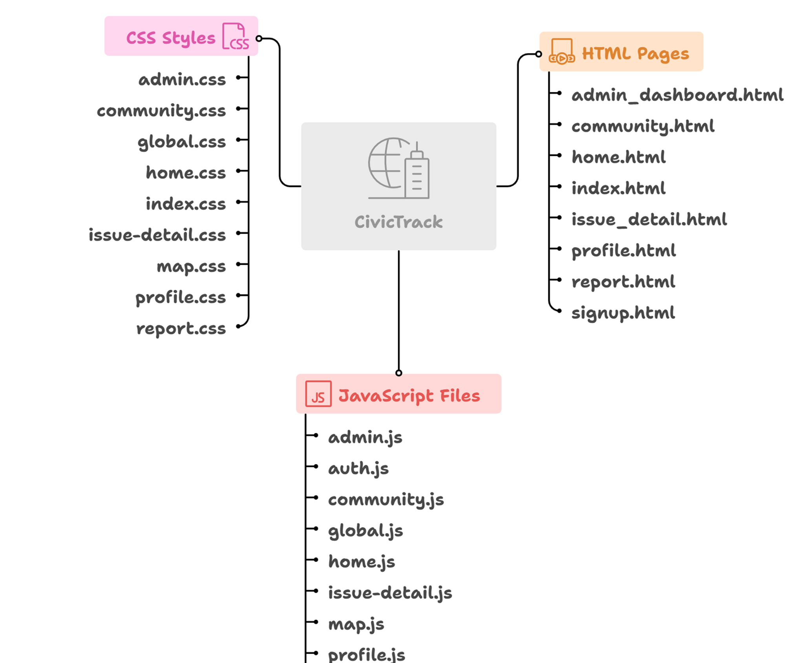

# 🚀 CivicTrack: A Smart Civic Issue Reporting Platform
> CivicTrack is a frontend-only civic engagement platform that enables citizens to report and track local issues using an intuitive, map-integrated interface.

---

## 📌 Overview
**CivicTrack** is a fully responsive, browser-based application designed to foster stronger communities through efficient civic issue reporting and transparent resolution tracking. Built with modern web technologies, the platform features seamless geolocation, an admin dashboard, and accessibility-first design.

---

## ✨ Features
- 📍 **Location-Based Reporting** – Submit issues with automatic geolocation
- 📝 **Comprehensive Forms** – Include titles, categories, priority levels, and optional images
- 🗺️ **Interactive Mapping** – Visualize issues with real-time status indicators using Leaflet.js
- 🧑‍💼 **Admin Dashboard** – Review, manage, and resolve issues with filtering and export features
- 🎨 **Modern UI** – Glassmorphism, smooth transitions, and 3D hover effects
- 👀 **Anonymous Submission** – Encourage reporting without personal details
- ♿ **Accessible Design** – Includes dark mode, high-contrast mode, and reduced motion support
- 📱 **Mobile-Ready** – Optimized for all screen sizes and devices

---

## 🛠️ Technology Stack
**Frontend:**  
`HTML5`, `CSS3`, `JavaScript (ES6+)`, `Bootstrap 5`, `Leaflet.js`, `FontAwesome`  

**Libraries & APIs:**  
- OpenStreetMap (mapping and tiles)  
- IntersectionObserver API (animation triggers)  
- FileReader API (image preview)  
- LocalStorage (session simulation)  

---

## 📁 Project Structure

---

## 🚀 Getting Started
### Requirements
- No backend required – runs entirely in the browser
- Modern browser (Chrome, Firefox, Edge)
- Internet connection for external resources

### Local Setup
```bash
git clone https://github.com/Navjot-21/CivicTrack.git
cd civictrack
```
Then navigate to: [https://github.com/SWAMI29/CivicTrack.git]

---

## 📖 Usage Guide
### 🔐 Login (index.html)
- Choose a role: User or Admin


### 🧭 User Dashboard (home.html)
- View all issues
- Filter by category, status, or search keywords
- Access interactive map with status indicators

### 📝 Report Form (report.html)
- Fill in issue title, category, priority, and description
- Use geolocation or manually pin location
- Upload image or provide image URL
- Optionally report anonymously

### 📂 Issue Detail (issue_detail.html)
- View full issue information and status history
- Admins can update status or remove reports

### 🧑‍💼 Admin Dashboard (admin_dashboard.html)
- Monitor issue counts by status
- Apply bulk actions (resolve/delete)
- Export issues as JSON

---

## 🎨 UI & Accessibility Highlights
- **Glassmorphism** – Blurred panels with transparency and color overlays
- **3D Transitions** – Depth effects on cards and buttons
- **Animated Backgrounds** – Gradients and motion particles
- **Custom Scrollbars** – Styled to match UI theme
- **Accessibility** – High-contrast, dark mode, motion control

---

## 📈 Scalability & Extensibility
- Clean codebase designed for integration with backend services (Node.js, Flask, Firebase)
- Easily extendable to include user authentication and persistent storage
- Modular JavaScript for adding REST APIs or third-party integrations

---

## 🚧 Future Enhancements
- 🔐 Authentication with OAuth or JWT
- 🔔 Real-time push notifications
- 📊 Advanced data visualization in admin dashboard
- 📱 Progressive Web App (PWA) for offline access
- 📥 Cloud database integration for persistent issue storage

---

## 🙏 Acknowledgments
- **Bootstrap** – Frontend utility framework
- **Leaflet.js** – Mapping library
- **FontAwesome** – Icon set
- **OpenStreetMap** – Map tiles and geodata
- **Unsplash** – Sample images used in mock data

---

## 📬 Contact
- **Email**: mayankkumarlinghe@gmail.com
- **GitHub**: [https://github.com/SWAMI29/CivicTrack.git]

> CivicTrack: Empowering Communities Through Civic Innovation

